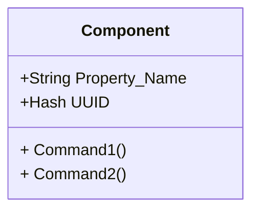
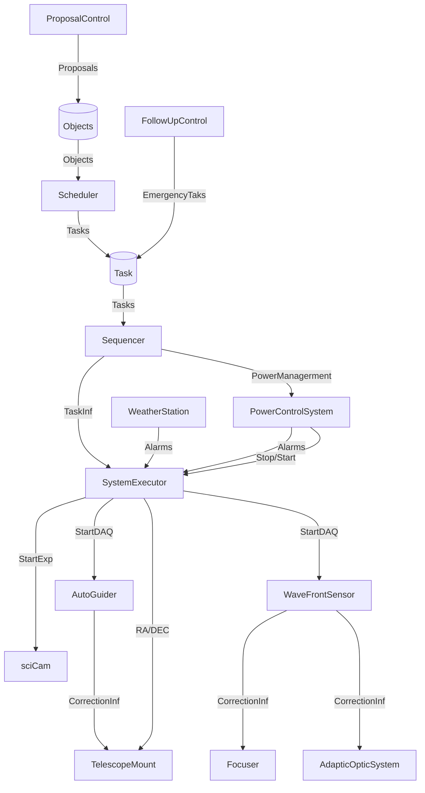
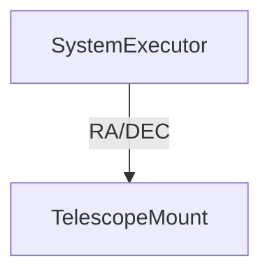
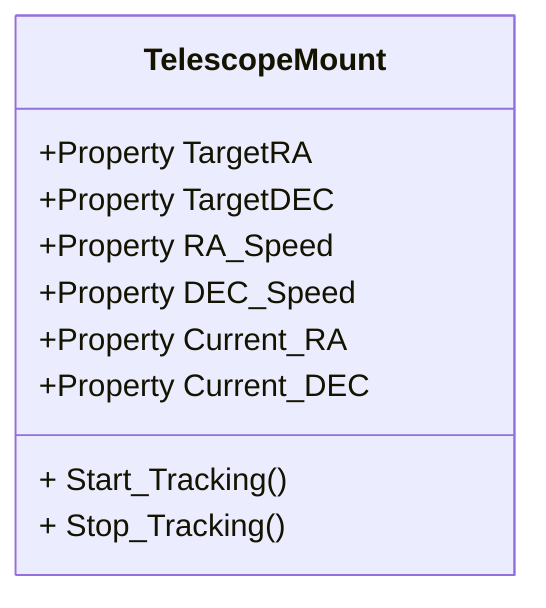
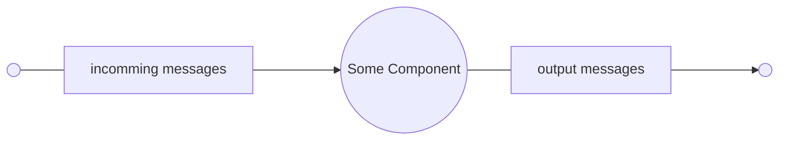

# What is RACS2 & TELES

*Author Wang Zhiyue*
## Motivation (If you don't like story, skip this)

Distributed instrument system is what we are dealing with during these days.
Astronomical telescope, as a very example, is becoming even more complicated than ever.

If you look at the broucher of an Astro-Physic mount in 1970s, you'll find that at that time, most telescopes consists of less than three parts: the mount, the telescope(or to say, the lens), and sometimes the camera.
First popular autoguider SBIG ST4 system didn't really become that popular, pointing of the mount became automatically at around 2000, before that, most of the telescopes systems in that era are mostly manual operated, simple, and clear.

Anyway, during past ten years, the telescopes system is becoming very smart.
An amateur telescope system of 2020 is normally equipped with a smart pointing mount, an autoguider, a fly-by-wire filter wheel and a electronic focusing system.
Things become even more terrifying for pros.
As an example, I've been working at WFST group, and let's take WFST as an exmaple: Every single part of WFST, literally every single part, is controlled by a corresponding program: 
from the primary mirror to the camera, from the mount to the dome, even the arm-chair in the observatory is AI driven(laugh). 
Basically, the whole thing is designed for fully-automatic operation.

That brings a problem to solve: how to controll all these systems?

Petr Kubernet developed a system named RTS2, which is used by many telescopes in Europe, around 2005. 
My friend, Zhang Guangyu is one of the pioneers in China who get a taste of the RTS2.
During 2012 to 2018, he adopt the RTS2 as the control framework for several telescopes, include CSTAR, BSST, MARST.
These telescopes are designed to work in the Antarctic,
and you can't expect any people stay there to operate these telescope,
moreover, you can't even rely on the satellite network to control them remotely since these satellite networks are slow, expensive, and quite unstable.
RTS2 based systems did some good job during those days.

Anyway, time flys, the world changes. 
Technique on this planet evolves every day.
RTS2 is becoming a system of yesterday.
First of all, RTS2 code doesn't use C++11 features,
since it is designed before that, 
and that is very not cool for C++ fanatics, like me.
What we found to be also very agnoising, is that
the *CentralD* service is sometimes unnecessary,
and sometimes not powerful enough.
And many fellows in my group do prefer python over C++,
and although I tried to, but I didn't convert them.
RTS2 doesn't provide a python interface 
(in fact, RTS2 only support C++ as a developing language).

All these drawbacks become the reason for us (reffer to out lab) to start
a new project, the RACS2. 
The RACS2 is the synonum for Remote Autonomous Control System 2nd, it contains many services.
the Teles is the kernel. By word *kernel*，I don't mean a centralized service, 
but a base class that define how the RACS2 component is built.
Besides the Teles, the RACS2 also provides a standard executor and scheduler service,
a backend that provides restful APIs to control the system, and many other services.
But the in order to use the RACS2 for your system, you need to build your devices' control programs base on teles,
and that's what this artile is about. That been said, you can develope your own scheduler, 
your own client based on this library.

Teles shared some features, or to say, inspirations,
with RTS2.
For example, Teles Uses very similar way to proceed command line arguments.
But the kernel of RTS2 is very different from RTS2:

+ RTS2 relys on the *CentralD* to find, record, and manage each nodes, while Teles use the *zyre* framwork to do this, therefore, you don't have to start some service before using Teles, or to say, the framework of Teles is **decentralized**.

+ RTS2 uses a homebrew message serialization library. I admit this utility did fulfill the requirement of RTS2, but if the user want to expand the system, it becomes a limitation. Why don't we use all these mighty opensouce serailization libraries? Avro, Protobuf, Thrift, even json is a lot more better than a DIY one, so Teles adopts protobuf as the serialization library, and the taste is sweet.

+ RTS2 managed all the network communication with bare sockets. In 2005, this might be very smart and resonable. But today, this is way too hardcore. Teles, on the other hand, use ZeroMQ as its communication library. ZeroMQ is lightweight, easy using and powerfull, why not?

+ From very first line of code, the developers of Teles cares very much about interfacing with other language eco-systems. As an example, the python interface of RACS2, Pyles, is almost the same age as Teles. As my personal flavor, goles is under development and shall face the users in near future. We have to admit, the reason why developing expansion of teles is simple is that the *Protobuf* itself is usable via many languages, so we kind of stole the thunder. Anyway, the choice of technology stack itself is a technology, so I have to tell Petr, "choose more wisely next time, my friend".

Although I have preached for many paragraphs, still I have to admit that,
Teles, along with its utilities (we call the whole eco-system RACS2, I don't think it is a good name but my boss insists, so I have to accept that.) is not fully fledged at the time of writing. 
And that is the reason why I write these essays. 
I want to introduce this framework to every one of you, 
and I want to assimulate the suggestions and feedbacks, 
so that Teles may become even more better than it is right now.

# Chapter.0 First Step

The basic unit of Teles is *component*. For some historical reason,
sometime we use *Peer* to refer to the same thing,
this two words means exactly the same in this article. 

A component have several user defined *Properties* and *Commands*,



And the instrument system consists of many Components, 
each controls the corresponding instrument, and the structure can be very very complicated, as following example shows:



As you can see, the whole structure can be very complicated, 
but most of the task can be asbtract into sending some kind of information,
from one component, to another.
So let's concentrate on this part of the system:



As an example, let's say this TelescopeMount component has these Properties and Commands:



For C++ User, You can create such a components with follow list:

```C++
using namespace tels;
class telescopeMount : public App {
public:
    telescopeMount() :App(){
        createProperty("TargetRA", Property::FLOAT, "Target RA value", true);
        createProperty("TargetDEC", Property::FLOAT, "Target DEC value", true);
        createProperty("RASpeed", Property::FLOAT, "Set this value to change RA tracking speed", true);
        createProperty("DECSpeed", Property::FLOAT, "Set this value to change DEC tracking speed", true);
        createProperty("CurrentRA", Property::FLOAT, "RA Value Returned by mount encoder", true);
        createProperty("CurrentDEC", Property::FLOAT, "DEC Value Returned by mount encoder", true);
        
        createCommand("Start_Tracking", 
            std::bind(&telescopeMount::StartTracking),
            "Start Tracking")
    }
}
```

If You are familiar with C++, the list itself is quite clear.
Basically, ```createProperty``` and ```createCommand``` are the
keys. ```createProperty``` creates a Property interface, 
and createCommand creates a Command. The mechansim of ```createCommand```
is rather simple: when the component recieved the command
(for example the \"Start_Tracking\"), 
the function (second argument in the ```createCommand``` call)
will be called, and you can implement your custom procedure instead the function.
Mechanism for Properties are a little bit different, 
when some other component tells the telescopeMount component to change the TargetRA Property, the telescopeMount will enter a ```onPropertyCommand``` function,
and process this event. 

This is all you need to know about interfaces declaring, 
and now the problem comes to the implementation.
Here's an exmaple of ```Start_Tracking``` function:

```C++
void telescopeMount::Start_Tracking(void) {
    telescope::Com.send("'TK:")
    return;
}
```

Handling of Properties are a little bit more complex,
Teles uses a ```onPropertyCommand``` function to process
the request of change a property.
You can override the ```onPropertyCommand``` functio and 
do anything you like inside it.
Here's an example:

```C++
void telescopeMoutnt::onPropertyCommand(std::shared+ptr<Peer> peer,
                                        const teles::proto::PropertyChange &msg)
{
    App::onPropertyCommand(peer, msg);

    auto prop = getProp(msg.name());
    if(msg.name() == "TargetRA") {
        if(msg.type != teles::proto::ProprtyType::float) {
            // Here is the error message
        }
        telescope::Com.send(msg.doubleval);
    }
} 
```

Here are many details to explain:

+ ```teles::proto::PropertyChange msg``` is a protobuf object. It contains many infomation you need: the new value that user assigned(```msg.doubleval\msg.intval\msg.stringval```), 
the type of this value(```msg.type```). 
Since change of every property will trigger this same function, 
so normally you will have to use the ```msg.name``` to indicate
which Property is being modyfied.

+  At the begining of this function, we highly recommend you to call App::onPropertyCommand(peer, msg). If the base class have some work to do inside it, you have to manually trigger it (Inevitably), otherwise you may encounter some very weird and un-debugable bugs.

+ the ```getProp()``` will return a pointer toward the Property which named ```msg.name()```. Teles will check the name of property at the time of calling ```addProp```, to avoid you from the naming ambiguity, so you can use this function as you like, without worrying about trivial spelling mistakes.


If you have finished the coding, simply use g++ to compile it and link to teles by -lteles. CMake is preferred but not mandatory.
Feel free to install the teles into you system path (/usr/lib, /usr/include) since we have already tested so.
If none of error occurred, you will get a executable now, and you can start it. Other component inside this LAN will find it automatically.

If you want to check if the component has started properly,
you can use the util name teles-tshell that shipped with teles library,
it provides a shell that equipped with some basic but mighty functions, 
with which you can find out which peers are inside the network, 
what properties do they have, what commands do they support, 
and actually change the property or trigger the command.
For more infomation about tshell, you can refer to the corresponding chapter.

# Chapter.1 The world of Teles


# Chapert.2 Understanding the thoughts in Teles

If you want to build a distributed system, 
a typical way is to define a set of RPC interfaces,
and let each part of you system to conmmunicate with each other
via these interfaces. 

Teles uses the ZMQ and the Protobuf to achieve this functionality.
Before any details, I have to give you some prepared information: the ZMQ, A.K.A zeroMQ, is not a Message-Queue. 
Instead, it is a development kit. You can regard it as a encapsulated socket library, only with many new features.
Zyre, build upon the zeroMQ, is an implementation of component network.
Zyre uses so called *RFC36* protocol for discovery and heartbeating,
teles just uses the Zyre to do the basic communication work. 

When the communication job is done, what's left is the RPC protocol.
The interfaces of teles are really simple, only four kinds of proto are needed:

+ Commands
+ Info
+ Log
+ Property

All the communication between teles components are one of these kinds,
in fact this is a facet of what we think the components are: 
we regard a component as an object with many properperties and some methods, which react to the incomming message and start conversation with
other components under some certain conditions. 
And the entire control system is build with these components. 



In some way, these thoughts are never science, 
they are more like state of art, or some philosophy, or some experience.
So if you find your thought very different from ours, 
it is very normal. Anyway, we found our way very useful in building telescope control systems, since:

1. Telescope control systems usually have tens or hundreds of instruments, and each of them usually has to collaborate with tens or hunders of others, to achieve some very basic functionality.

2. The system is very complicated, instruments and links are many. However, the communication between different instruments, surprisingly, are usually simple. Most of the communications are just like "K1 is V1, K2 is V2", or "set K1 to V1, set K2 to V2", or combination of both.

3. Sometimes, the communication between different instruments can be rather complicated (but the odd is really rare). 


Because of the rule.1, we think the traffic in the network can be massive,
centralized structure must suffer from hotspot problem someday. 
Because of the rule.2 we used **Properties** as the abstracts of each physics attributes of instruments,
we optimized the communication mechanism about properties, 
and try to minimize the traffic overhead in property messages. 
Finally, because of the Rule.3, we use **Command**s to implement 
these rather complicated behaviors.
In fact, these rules are basically equivalent to 
general Object Oriented design pattern.
If you are familiar with C++, python or some other OO programming language, 
you can get this piece of mind very easily. 

In teles, you can create your custom property of you components
simply by calling ```createProperty``` function, here is the prototype:

```c
std::shared_ptr<Property> createProperty(std::string prop_name, PropertyType prop_type,
        std::string desc, bool writable);
```

There is also another ```createProperty``` which allows you to create a *Property* with unit.
The first argument ```prop_name``` is just the name of your property to create, 
although every legal utf-8 character is allowed, 
we recommend you to use the C++ naming convention for the ```prop_name```.
```prop_type``` is one of INT, DOUBLE, STRING, 
which is the type of property. 
```desc``` is the description of the property, you can fool around with it as you like.
As you can see, these arguments are quite clear. 
Normally, you should call ```createProperty``` inside the constructor
of your component, but calling this method later under other context is not banned.
So you really can generate new properties at runtime.

When you call this method, 
the framework will just do someting like this:

```c++
std::shared_ptr<Property> Daemon::createProperty(std::string prop_name, PropertyType prop_type,
        std::string desc, bool writable)
{
    property_map[prop_name] = std::make_shared<Property>(prop_name, prop_type,
        desc, writable, this);

    return property_map[prop_name];
}
```
Quite straight forward isn't it? The real code is a little bit more complicated,
but meaning is exactly the same.

When you want to change a property to some other value, 
you need to firstly get the property by calling ```getProperty```, 
it is something like this:

```c++
std::shared_ptr<Property> getProp(std::string prop_name) {
    return property_map[prop_name];
}
```
with the pointer to the property, you can just call ```Property::setValue```
to change its value. 

When you want to change the property of another component inside the network,
it is also very simple, you can use ```getPeerByName``` or ```getPeerByUUID```
 to get a pointer to the peer you want to operate,
and use ```network->changeProperty``` to operate on the peer.
Following list shows a simple example:

```c++
auto peer = network->getPeerByName("Mount");
auto prop = peer->getProperty("target_RA");
prop.setValueDouble(0);
network->changeProperty(peer, prop);
```

And a message that contains the infomation of the new value of target_RA will be 
sent to the Mount component. If you are using pylets, you can use the 
encapsulated function ```setprop()``` to do the same thing with fewer code lines.
C++ library don't have such utilities right now, but if you feel it neccessary you can build one by you own.

Before we move on to the next topic, I have to claim some information.
You should alway bear in mind that when you use the ```getPeerByName``` to get a pointer to the peer, 
you are not really operating that peer directly, even if that component is running on the same host,
and all the code give you the feeling that you are operating it directly, **you are NOT**.
Actual work are done by a lot of RPC calls. 
Teles uses some local cache for your coding convinience, but caches are always caches.
Don't get fooled by these illusions.

Now there is still a problem to solve. 
When a custom property is defined,
you often want to define the behavior of the component
when this property is changed as well. 
That's why we need to override the default *onPropertyCommand* function.
*onPropertyCommand* function is called every time a property is changed.
I now put its prototype here:

```cpp
  virtual void onPropertyCommand(std::shared_ptr<Peer> peer, const teles::proto::PropertyChange &msg);
```

As you can see in the list, the *onPropertyCommand* function
has two arguments: the *peer*, which points to the component which 
triggered this event, and the *msg*, which contains the infomation about
which Property is to be changed. You can study further into the 
```teles::proto::PropertyChange``` type by checking the Protobuf Messgae definition:

```protobuf
message PropertyChange {
    string name = 1;
    bool command = 8;
    oneof property_type {
        PropertyInt intval = 2;
        PropertyString strval = 3;
        PropertyDouble doubleval = 4;
        PropertyStrList strlist = 5;
        PropertyIntList intlist = 6;
        PropertyDoubleList doublelist = 7;
    }
    google.protobuf.Timestamp send_ts = 10; // timestamp before send
    
```

You don't have to understatnd the meaning of the numbers, 
they are just some protobuf features. 
You just have to concentrate on each field of this definition.
The ```name``` field is the name of the *property* to be changed. 
The fields which have ```val``` postfix are just different types of values, 
such as ```intval``` \\ ```strval``` \\ ```doubleval```.
Note that the ```oneof``` key word means that 
one message can contain only on of these fields(that very clear, 
since each property only has one type, you can't specify two types
of value for it). 
The ```send_ts``` field is a timestamp which indicates the time at which
the message is generated. The perfomance measuring facilities 
of TELES relies much on this fields to calculate the delay,
throughput and other parameters of the framework. 

```commmand``` is somehow a little bit tricky,
it indicate if this Message is Imperative or Declarative. 
if ```command``` is set to true, the message means 
"I want you(the component that receive this message) to change the property to the value I gave you".
And if ```command``` is set to false, the message means 
"Now I tell you that the compoent's property is changed to the value".
This seemed to be weird, but it comes with reason. 
When the *onPropertyCommand* function finishes successfully,
it will automatically broadcast some message to let everyone know that
the property of the component is changed to the value, and
with the design above, the peer can simply change the ```command```
field of message it received to false, and broadcast the message, 
instead of build a new messgae (which costs more resources).
Anyway, if you want to extent the TELES framework, 
you may want to pay extra attention to this feature.

Let's come back to the *onPropertyCommand* function.
Now you know the meaning and schema of its arguments, 
and you can simply write your own code inside it, 
still, you need to follow some conventions:

+ you should always call the onPropertyCommand function of your parent class, for exmaple, when you derived from ```App```, you should call App::onPropertyCommand inside you implementation
+ If you are using *pyles*, you should follow the convention as well by calling ```supper().onPropertyCommand()```
+ Properties are indexed by their name, although you can't call ```addProperty``` with same name twice (otherwise you will get a runtime error), you should alway remember this feature.

As a conclusion of the above discussion, 
I'll put some of the drawbacks of *Property* mechanism here:

+ If the code you write inside *onPropertyCommand* 
will block the execution for a long time, you should pay extra attention,
TELES waits synchronosly for your code to complete in this function.
Therefore if the code stucks inside *onPropertyCommand*, it will just stuck there and ignore other messages

+ You still think the *onPropertyCommand* to be too complicated?
I think so. Becase of all the details you have to deal with,
this function is not that clever right now. You still have to manually
check the name of the property, check the thresholds of values, 
and call the *onPropertyCommand* of parent class by yourself.
These complicity are of course some drawbacks, but as you can see, 
you will have to sacrifice the freedom if you want to make this function cleverer.


You have enough knowledge about the *Property* mechanism right now, 
many problems can be solved by *Property* mechinism, 
but some other problems can be solved by using *Command* mechanism more properly and gracefully,
so let's introduce the *Command* mechanism.


